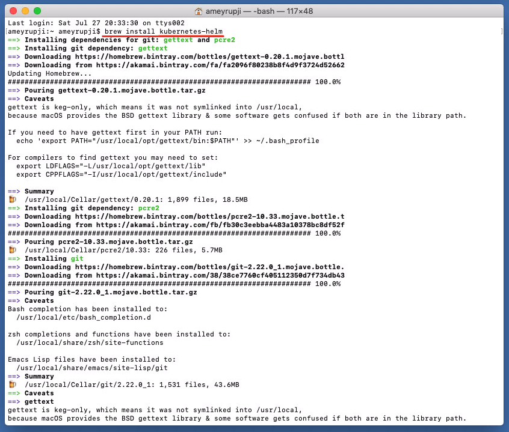
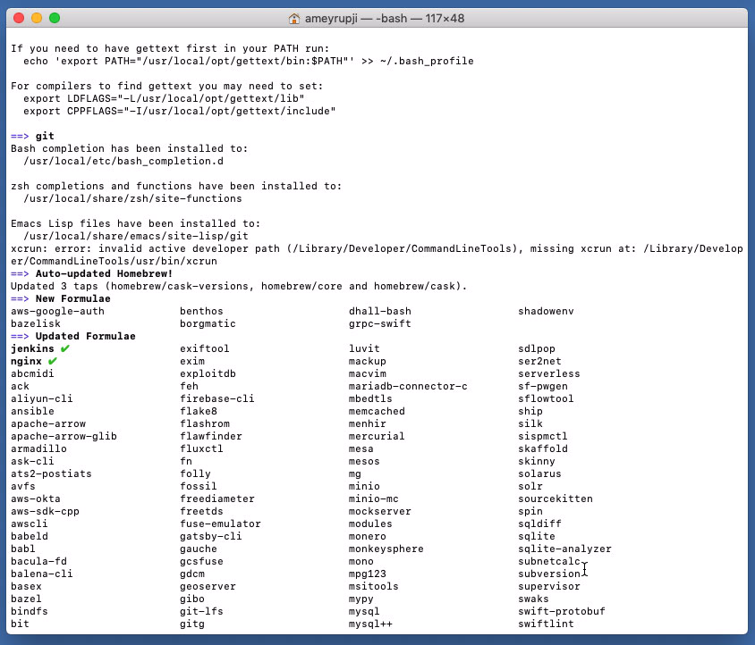
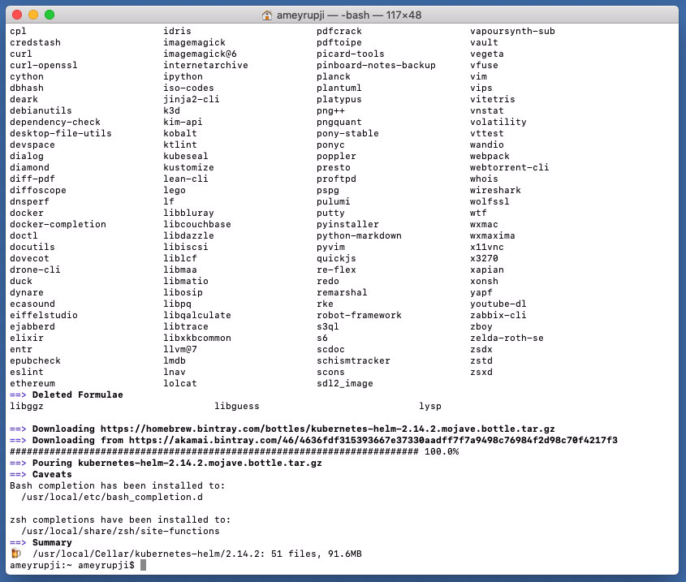
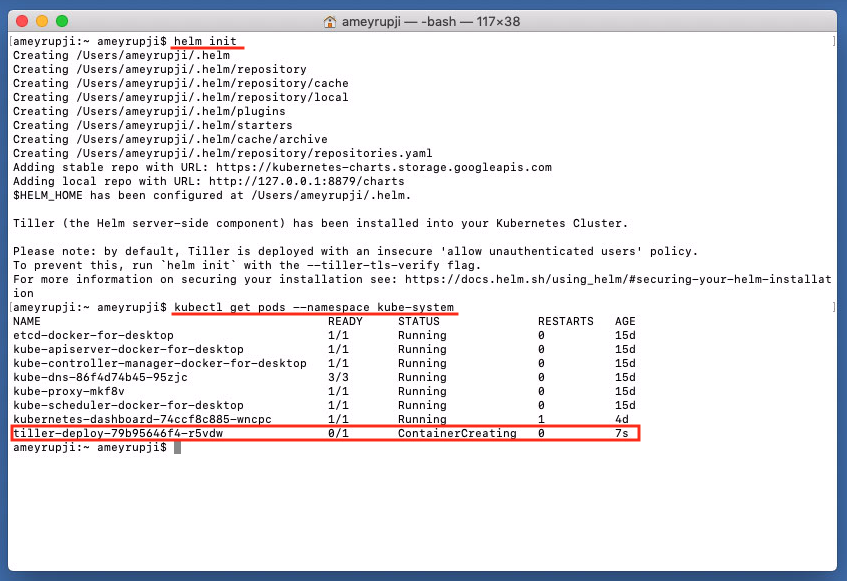
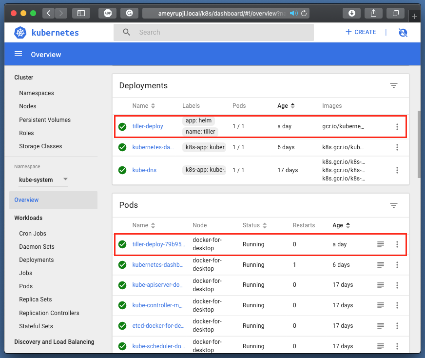

# ameyrupji.local-helm
This repository outlines the steps to setup Helm on the Kubernetes cluster on MacOS.

## Prerequisites 

- HomeBrew installed (Installation instructions: https://www.howtogeek.com/211541/homebrew-for-os-x-easily-installs-desktop-apps-and-terminal-utilities/)
- Kubernetes Cluster installed (Installation instructions: https://github.com/ameyrupji-local/ameyrupji.local-kubernetes)

## System Configuration at time of test

- macOS Mojave - Version 10.14.6 

## Installation instructions

### Brew install

These instructions are used to install Helm using brew. Run the following command in a terminal: `brew install kubernetes-helm`

 

 

 

### Installing Tiller

Tiller, the server portion of Helm, typically runs inside of your Kubernetes cluster. But for development, it can also be run locally, and configured to talk to a remote Kubernetes cluster.

Run the following command on the terminal to initialize Helm: `helm init` and install Tiller.

This should install and start up tiller pod. To view if the pod is running run the following command: `kubectl get pods --namespace kube-system`

 

### Upgrading Tiller 

As of Helm 2.2.0, Tiller can be upgraded using `helm init --upgrade`

## Test 

Open Safari it by going to URL on other network computer and go to the following link: `http://ameyrupji.local/k8s/dashboard`

## Cleanup

Because Tiller stores its data in Kubernetes ConfigMaps, you can safely delete and re-install Tiller without worrying about losing any data. The recommended way of deleting Tiller is with `kubectl delete deployment tiller-deploy --namespace kube-system`, or more concisely `helm reset`.

Tiller can then be re-installed from the client with: `helm init`

## Useful Links

- https://www.macminivault.com/installing-jenkins-on-macos/
- https://mgrebenets.github.io/mobile%20ci/2015/02/01/jenkins-ci-server-on-osx
- https://wiki.jenkins.io/display/JENKINS/Jenkins+behind+an+NGinX+reverse+proxy
- https://medium.com/okteto/develop-helm-applications-directly-in-your-kubernetes-cluster-cb385aa8328f
